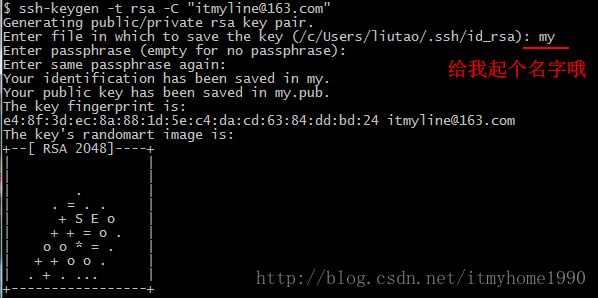
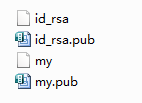

一台电脑上有一个ssh key，在github上提交代码，由于其他原因

你可能会在一台电脑上提交到不同的github上，怎么办呢...
假设你电脑上一个ssh key都没有,如果有默认的一个了，请直接生成第二个

## 一、生成并添加第一个ssh key

`$ ssh-keygen -t rsa -C "youremail@xxx.com"`
在Git Bash中执行命令一路回车，会在~/.ssh/目录下生成id_rsa和id_rsa.pub两个文件
用文本编辑器打开id_rsa.pub里的内容，在Github中添加SSH Keys

不明白的请参考GitHub创建SSH Keys


## 二、生成并添加第二个ssh key

`$ ssh-keygen -t rsa -C "youremail@xxx.com"`
这次不要一路回车了，给这个文件起一个名字 不然默认的话就覆盖了之前生成的第一个

  


假如起名叫my,目录结构如下：

  

如果生成的第二个ssh key不在.ssh/下，可移动到此目录


## 三、在.ssh/下创建config文件 内容如下：

```shell
Host github.com
    HostName github.com
    PreferredAuthentications publickey
    IdentityFile ~/.ssh/id_rsa

Host my.github.com
    HostName github.com
    PreferredAuthentications publickey
    IdentityFile ~/.ssh/my
```

Host名字随意，接下来会用到。

## 四、测试配置是否正确

  

  


如果出现Hi xxx!You've successfully authenticated 就说明连接成功了


## 现在就以下种情况给出不同的做法：

### 1、本地已经创建或已经clone到本地：

如下两种解决方法：

打开.git/config文件

``` shell
#更改[remote "origin"]项中的url中的
#my.github.com 对应上面配置的host
[remote "origin"]
	url = git@my.github.com:itmyline/blog.git

#或者在Git Bash中提交的时候修改remote
$ git remote rm origin
$ git remote add origin git@my.github.com:itmyline/blog.git
```

 2、clone仓库时对应配置host对应的账户 

```shell
#my.github.com对应一个账号
git clone git@my.github.com:username/repo.git
```


